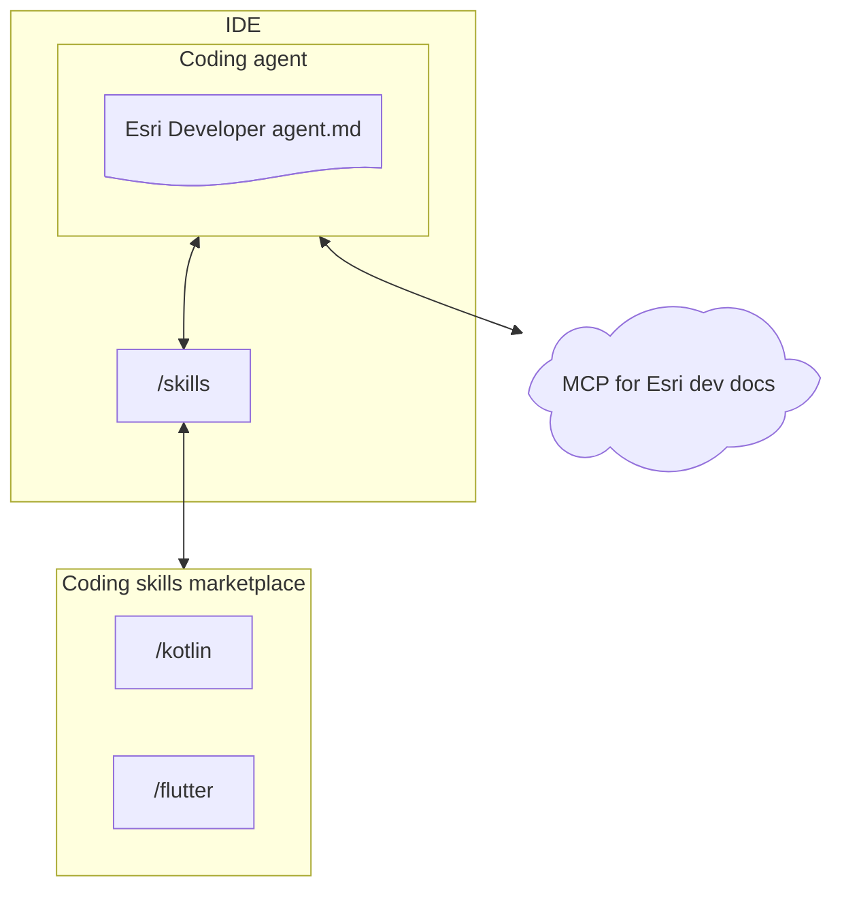

# Agentic engineering

Setting up your agentic IDE for building Esri-powered apps requires an installation of the coding skills plugin and a connection to the MCP for Esri developer documentation.



## Install

The retained [Esri Developer agent](agents/Esri%20Developer.agent.md) provides general project discovery and MCP documentation-search guidance. Install the `esri-developer-skills` plugin to add platform and library-specific instructions.

### GitHub Copilot CLI

From a local checkout:

```powershell
copilot plugin marketplace add .
copilot plugin install esri-developer-skills@arcgis-coding-skills
```

From GitHub:

```powershell
copilot plugin marketplace add https://github.com/williambohrmann3/arcgis-coding-agents
copilot plugin install esri-developer-skills@arcgis-coding-skills
```

### Claude

From a local checkout:

```powershell
claude plugin marketplace add .
claude plugin install esri-developer-skills@arcgis-coding-skills
```

From GitHub:

```powershell
claude plugin marketplace add https://github.com/williambohrmann3/arcgis-coding-agents
claude plugin install esri-developer-skills@arcgis-coding-skills
```

### Codex

The repository exposes a Codex-compatible marketplace manifest at `.agents/plugins/marketplace.json`.

Verify an installation with `copilot plugin list` or `claude plugin list`, then inspect available skills with `/skills list`.
